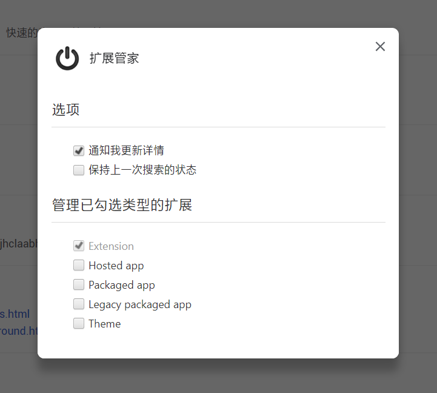
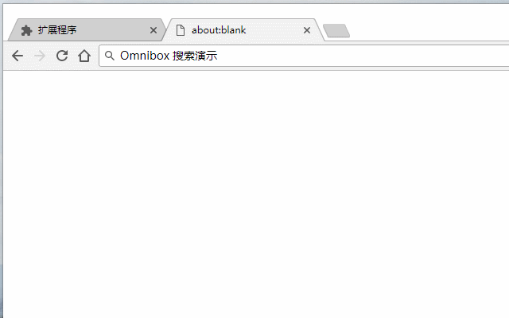

# Extensions-Steward

> Chrome Extension

## Introduction

扩展管家，快速启用、禁用扩展。禁用全部扩展和恢复被禁用的扩展

## Screenshot

管理指定类型的扩展

使用 Omnibox（地址栏）方便的搜索 Chrome 扩展

## FAQ

- 为什么不提供移除其他扩展的功能？
  + 由于缺少设计方案，因此暂时不提供此功能
- 触发 Omnibox（地址栏）事件的关键字是什么意思？
  + Extensions Management Searcher 首字母的缩写（ems）